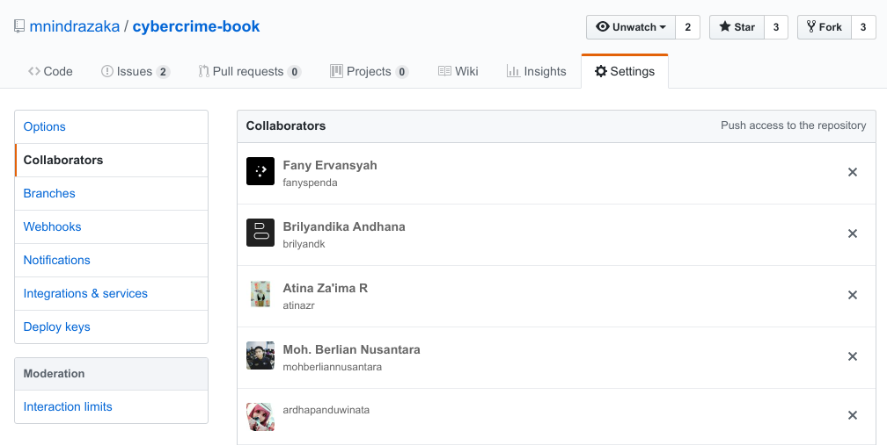
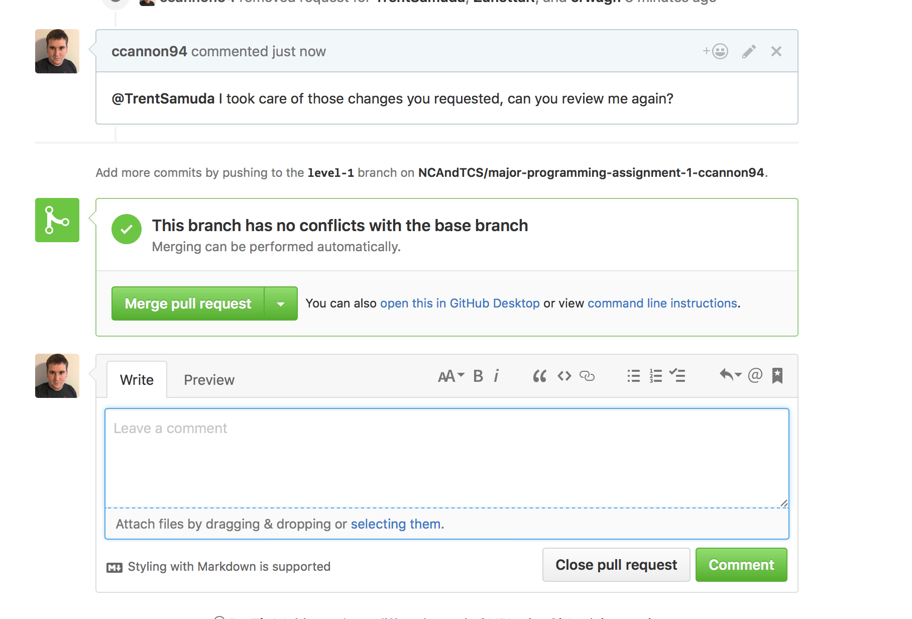

# Pull Request Menggunakan Branch

## 1. Persiapan Repo

1. Buat remote repo baru di github
2. Undang collaborator pada menu `Settings > Collaborators`

   

3. Tambahkan proteksi untuk branch master agar tidak bisa di push secara langsung, dapat diakses pada menu `Settings > Branches`

   

4. Clone remote repository

   ```bash
   git clone [url]
   ```

## 2. Membuat Commit Pada Branch Baru

1. Buat branch baru pada local repo

   ```bash
   # membuat branch
   git branch [nama-branch]

   # pindah ke branch
   git checkout [nama-branch]
   ```

2. Lakukan perubahan

3. Buat commit

   ```bash
   git add .
   git commit -m "keterangan commit"
   ```

4. Push ke remote menggunakan branch baru tersebut

   ```bash
   git push origin [nama-branch]
   ```

## 3. Melakukan pull request

1. Buat pull request ke master dengan cara klik pada tombol `Compare & Pull Request`

   

2. Berikan review pada pull request

   

3. Terima pull request dengan cara klik pada tombol `Merge pull request`

   

4. Delete remote branch setalah pull request diterima dengan cara klik pada tombol `Delete branch`

   

## 4. Update Repo Local

1. Pindah ke branch master

   ```bash
   git checkout master
   ```

2. Update commit pada branch master

   ```bash
   git pull origin master
   ```

3. Delete local branch yang tadi sudah di pull request

   ```bash
   git branch -D [nama-branch]
   ```
